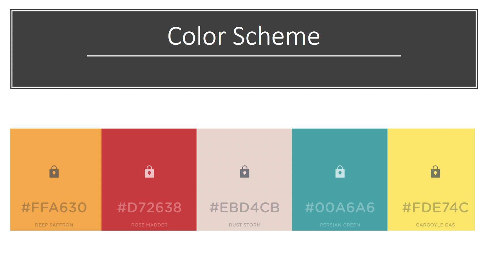
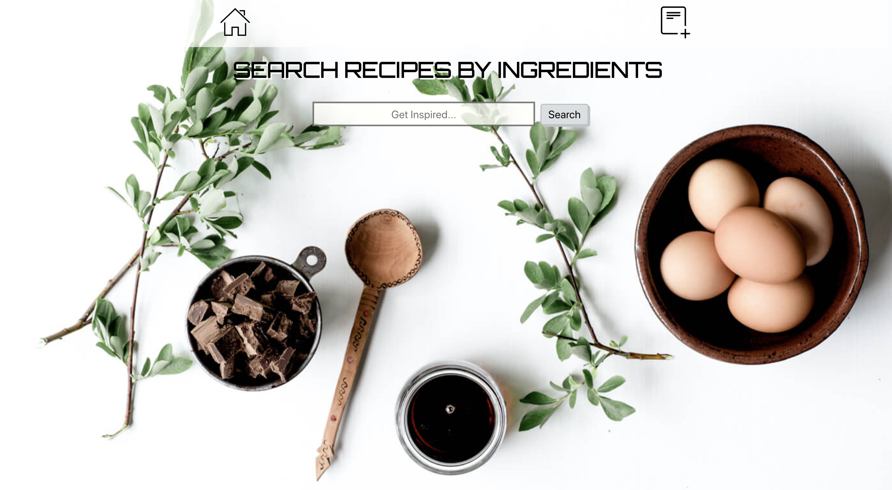

# Recipe App

## MVP

An app where the user can browse through different recipes and is able to access these recipes by clicking on links that will redirect them to the full recipe’s instructions.

## User Story

> Natalie loves to cook. She craves for an app that could have recipe ideas.

## Wireframe

## Color Palette Idea One

Initially I chose to use colors that are usually associated with food.
My first issue with this palette was that I had no control over the pictures rendered by the API.
So I came to the conclusion that choosing more neutral colors would make the recipe pictures pop out more.

## Color Palette Idea Two

The palette I went with is a combination of neutral colors, which makes so that the attention is drawn to the recipes' pictures rather than have the colors and images compete for the users' attention.

## Issues With First Palette

## Home Page

## Search Results

## Issues encountered
